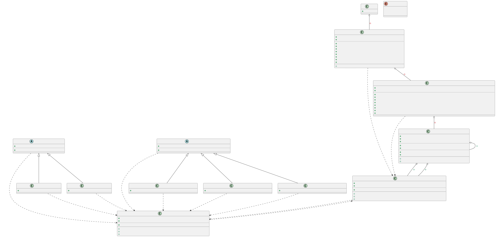

# Markov Music - Developer Documentation

## Class Diagram



## Data representation

### Token

Token is a triple `(pitch_delta, duration, wait)` representing a note relative to the previous one.

- **pitch_delta** - change in [MIDI pitch](https://en.wikipedia.org/wiki/MIDI_tuning_standard) relative to the previous note
  - Using pitch delta instead of absolute pitch reduces the number of distinct tokens, making the model work well even on small training data
- **duration** - duration of the note in units
- **wait** - waiting time before the next note in units
  - Using `wait=0` allows playing chords

> 1 unit equals a sixteenth note. \
> `EMPTY_TOKEN = (pitch_delta=0, duration=0, wait=0)` is used as a padding at the start. \
> `END_TOKEN = (pitch_delta=-1, duration=-1, wait=-1)` marks the end of a track. \

### Track

Track is a sequence of tokens representing a musical piece.

## Markov Trie

Markov Trie is a trie structure storing the trained data.
Tokens represent the edges, and each node represents a history (sequence of past tokens).
Each path from the root represents a history of tokens in reverse order (the edges closest to the root represent the most recent tokens).
Each node stores how many times each token followed the history represented by the path from the root to that node.

### `insert`

- For each node along the path corresponding to the history, increment the count of the inserted token

### `predict`

- For each node along the path corresponding to the history, filter out tokens that would result in a pitch outside the valid range
- Assign each valid token a weight based on its count multiplied by the square of the depth
  - This makes deeper nodes (with longer history) contribute more, without ignoring shallower ones
- Draw a token at random proportionally to the accumulated weights

### `get_probability`

- For each node along the path corresponding to the history, compute the probability of the given token as its count divided by the total valid count
- Multiply each depth's probability by the square of that depth
  - This makes deeper nodes (with longer history) contribute more, without ignoring shallower ones
- Return the weighted average across all depths

### `size`

- Returns the total number of nodes in the trie, including the root (always at least 1)

### `prune`

- Remove all transitions whose count is below the threshold
- If a node becomes empty, remove its children too

### `operator+`

- Merges two tries by combining token counts and recursively merging children

## Music Model

Music Model wraps Markov Trie and exposes the 3 main operations of the program: training, generation and evaluation.
The maximum history length is defined by `MAX_ORDER`.

### `train`

- Insert each token of the track into the Markov Trie with its history

### `generate_track`

- Generate the track token by token, each time predicting the next token using the Markov Trie

### `evaluate`

- Compute the geometric mean of the token probabilities using `get_probability`
- Add a small epsilon to each probability before taking the log to avoid log(0) = `-inf` for unseen tokens

### `size`

- Returns the size of the underlying Markov Trie

### `prune`

- Prunes the underlying Markov Trie

### `operator+`

- Merges two models by merging their underlying Markov Tries

## Formats

Formats are implemented using the `NoteLoader` and `NoteSaver` abstract classes:

```cpp
class NoteLoader { virtual Notes load(std::istream&) = 0; };
class NoteSaver  { virtual void save(const Notes&, std::ostream&) = 0; };
```

To add a new format, implement one or both classes and register them in `formats.cpp`.

### MIDI

- **Load**: parses all tracks, converts MIDI ticks to units, snaps to a time grid
- **Save**: converts notes to NOTE_ON/NOTE_OFF events, writes a single-track MIDI file

### Plain

- **Load**: reads lines of `pitch start duration`, skips zero-duration notes
- **Save**: writes one note per line as `pitch start duration`

### ABC

- **Save**: converts notes to ABC notation with chord, tie, and rest support

## Implementation Challenges

- Token storage
  - Trie
- Score weighting
  - Quadratic depth weighting
- Chord support
  - `wait = 0` in Token
- Token generalization
  - `pitch_delta` instead of absolute pitch
  - Time grid snapping

## Scripts

Two Python scripts are provided in the `scripts/` directory for preparing training data from [The aria-MIDI Dataset](https://github.com/loubbrad/aria-midi).

### `extract.py`

Extracts MIDI files for a given composer from the dataset into a directory.

```bash
python3 scripts/extract.py bach data/train/bach --dataset aria-midi
```

### `split.py`

Moves a random sample of files from one directory to another.

```bash
python3 scripts/split.py data/train/bach data/test/bach --count 20
```
